# NT-100 異音チェッカー 取扱説明書

**Ver 4.04**

## 安全にご使用いただくために

### ＜安全表記について＞

- ご使用の前に、この取扱説明書と本ユニットに接続されるすべての機器および周辺装置の取扱説明書および関連書類をすべて熟読し、正しくお使いください。また、これらの作業は、機器や安全に関する十分な知識を持った方によって行ってください。

- 以下に示す注意事項は、お使いになる方や、他の方への危害、財産への損害を未然に防ぐための内容を記載していますので、必ずお守りください。

- 次の表示の区分は、表示内容を守らず、誤った使用をした場合に生じる危害や損害の程度を説明しています。

  --- **⚠危険** ---
  > 取り扱いを誤ると、死亡または重傷に至る危険がある内容です。

  --- **⚠️注意** ---
  > 取り扱いを誤ると、傷害または物的損害の可能性がある内容です。

- なお、「注意」であっても、状況によっては重大な結果を招く可能性があります。「危険」・「注意」ともに重要な内容を記載していますので、ご熟読の上で十分に注意してお取り扱いください。

- この取扱説明書は、必要な時にいつでも取り出して読めるように大切に保管するとともに、必ず、最終ユーザー様まで、お届けいただきますようにお願い致します。

- 次に示すような条件や環境で使用する場合は、定格、性能に対して余裕を持った使い方やフェールセーフなどの安全対策へのご配慮をいただくとともに、当社営業担当者までご相談いただき、仕様書等による確認をお願いします。

  1. 原子力制御・鉄道・航空・燃焼装置・医療装置・娯楽機械・安全機器などへの使用

  2. 人命や財産に大きな影響が予測され、特に安全性が要求される用途への使用

### ＜全般＞

--- **⚠️注意** ---

- 仕様範囲外では使用しないでください。仕様範囲外で使用されますと、製品の故障、機能停止や破損の原因になります。

- 製品の改造は絶対に行わないでください。異常動作によるケガ・感電・火災などの原因になります。

### ＜保管・運搬＞

--- **⚠️注意** ---

- 製品の重量に応じて、正しい方法で運搬してください。

- 製品の上に、重いものを載せたりしないでください。

### ＜設置・配線＞

--- **⚠危険** ---

- 非常停止、停電などシステムの異常時に、機械が停止する場合、装置の破損・人身事故などが発生しないよう、安全回路あるいは装置の設計を行ってください。

- 発火物・引火物・爆発物等の危険物が存在する場所では絶対に使用しないでください。発火・引火・爆発の可能性があります。

- 水滴・油滴などがかかる場所での使用は避けてください。

- 配線作業は専門の技術者が行ってください。

- 本ユニットは必ず、Ｄ種設置工事を行ってください。漏電した場合、感電する可能性があります。

- ケーブルは傷つけたり、引っ張ったり、無理なストレスをかけたり、重いものを載せたり、挟み込んだりしないでください。感電・誤動作・焼損の可能性があります。

--- **⚠️注意** ---

- 直射日光の当たる場所、塵埃、塩分、鉄粉のある場所、高温・多湿状態の場所、有機溶剤等が含まれている雰囲気中で使用しないでください。急激な性能低下や誤動作を起こす可能性があります。

- 大きな振動や衝撃が伝わる場所に設置しないでください。大きな振動や衝撃が伝わると誤動作を起こす可能性があります。

- 本ユニットの取り付けには、保守作業用のスペースを確保してください。

- 下記の場所で使用する場合には、遮蔽対策を十分に行ってください。措置しない場合には、誤動作を起こす可能性があります。

  1. 大電流や高磁界が発生している場所
  2. 溶接作業などアーク放電の生じる場所
  3. 静電気などによるノイズが発生する場所
  4. 電源線が近くを通る場所
  5. 放射能に被爆する可能性がある場所

- 配線は正しく・確実に行ってください。誤動作を起こす可能性があります。

### ＜運転＞

--- **⚠危険** ---

- 運転中に水や油をかけないでください。感電や火災などの原因になります。

- 運転中は通電部には絶対に触れないでください。感電する恐れがあります。

- 濡れた手で操作しないでください。感電する恐れがあります。

- 製品の開口部に指や物を入れないでください。感電・故障・ケガの恐れがあります。

--- **⚠️注意** ---

- 運転中はケーブルの抜き差しを行わないでください。誤動作を起こす可能性があります。

- 設備に影響がないことを確認してから、テスト運転を行ってください。

- エラー発生時には、原因を取り除き、安全を確保してからエラーリセットし、再運転してください。

### ＜保守・点検について＞

--- **⚠危険** ---

- 製品の分解は絶対に行わないでください。ケガ・感電・火災などの原因になります。

--- **⚠️注意** ---

- 製品に関わる保守点検、整備または交換などの各種作業は、必ず電源の供給を安全に遮断してから行ってください。

- 製品が使用不能または不要になった場合には、一般産業廃棄物として処置してください。

### ＜保証＞

お買い上げ頂きましたユニットに万が一不都合が生じた場合は、以下のように保証致します。

#### ＜保証内容＞

ユニットを構成する部品において、その素材、あるいは製造上の不具合が原因で何らかの故障を生じた場合、無償で修理または交換致します。

#### ＜保証期間＞

出荷後、１年を経過するまでを保証期間と致します。

#### ＜保証除外事項＞

次の場合には保証は除外されます。

1. 経時変化あるいは使用損耗により発生する不具合（塗装、メッキなどの自然褐色、消耗部品の劣化など）

2. お客様にて作成および変更されたプログラム、パラメータ等の内部データの不具合  
※サンプルプログラムを加工して利用した場合も含む

3. 日本国内で購入された装置を国外へ持ち出した場合

4. 地震、台風、水害、落雷などの天災、または事故、火災などで発生した不具合

5. 弊社に無断で改造されている場合

6. 保守点検上の不備または間違いがあった場合

7. 本書に記載されている注意事項に該当する行為と認められた場合

#### －　重要　－

**株式会社エヌエスティー（以下弊社）は、本取扱説明書の記載を越えるいかなる明示または黙示の保証は致しません。保証内容は上記の範囲に制限するものとします。弊社は、弊社が販売したユニットに対してのみ責任を負うものとし、（契約、保証、過失、または責任から発生したかどうかに関わらず）他のいかなる損害に対しても責任を負いません。なお、弊社より供給されたものではない付属品や部品においては、いかなる保証も致しません。**

***改 訂 履 歴***

| バージョン | 日付         | 内容  |
| ----- | ---------- | --- |
| 1.00  | 2022/10/13 | 初版  |

## 目次

１章　製品の概要

　本章では、ユニットの概要について説明します。

# 製品の概要

## 概要

嵌合音チェッカーは、コネクタの嵌合音をマイクにてサンプリングしＦＦＴ解析後、判定する

嵌合確認ユニットです。

　判定結果は液晶パネル表示及びユニット背面の端子より出力します。

## 外観、寸法

　　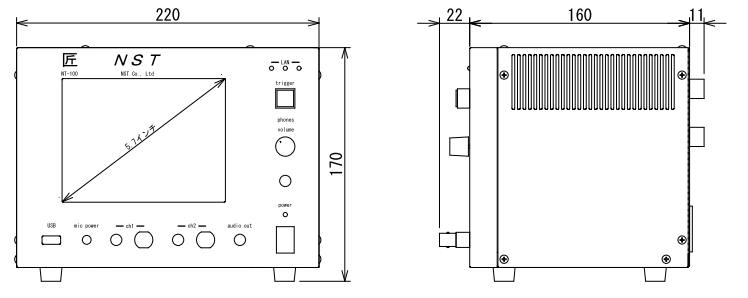

　　　　　　　　　　　前面図　　　　　　　　　　　　　　　　　　　　　　右側面図

　　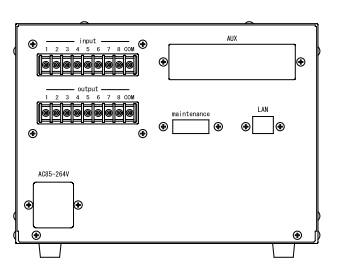

　　　　　　　　　　　背面図

２章　据付

　本章では、ユニットの据え付け方法を説明します。

# 据付

## 設置条件

### 設置環境

本ユニットを設置するにあたり、以下の環境を必ず守るようにしてください。

<table>
<colgroup>
<col style="width: 21%" />
<col style="width: 78%" />
</colgroup>
<tbody>
<tr class="odd">
<td>項目</td>
<td>仕様</td>
</tr>
<tr class="even">
<td>許容周囲温度</td>
<td>０～６０℃（凍結なきこと）</td>
</tr>
<tr class="odd">
<td>許容周囲相対湿度</td>
<td>５～８５％（結露なきこと）</td>
</tr>
<tr class="even">
<td>高度</td>
<td>平均海抜０～１０００ｍ</td>
</tr>
<tr class="odd">
<td>周囲環境</td>
<td>
水、切削水、油、有機溶剤がないこと

腐食性ガス、腐食性物質がないこと

可燃性ガス、引火性液体の雰囲気でないこと

近くに強力な磁場や電磁妨害、静電気放電、無線電波妨害をするものがないこと
</td>
</tr>
<tr class="even">
<td>振動</td>
<td>衝撃、振動が伝わらないこと</td>
</tr>
<tr class="odd">
<td>作業スペース</td>
<td>作業（ティーチング、点検、修理）を安全に行えるスペースがあること</td>
</tr>
</tbody>
</table>

　**危険**

　　　　　許容周囲温度、許容周囲相対湿度を越える場所への設置、水、腐食性ガスなどが発生する環境では

　　　　　使用しないでください。誤動作、故障、漏電の原因となります。

　**危険**

　　　　　本ユニットは防爆仕様ではありません。

　　　　　可燃性ガス、引火性液体などの雰囲気では使用しないでください。

　　　　　爆発、引火の恐れがあります。

　**注意**

　　　　　電磁妨害、静電気放電、無線電波妨害の恐れがある場所では、遮蔽対策を十分に行ってください。

> 措置を行わない場合、誤動作する恐れがあります。

　**注意**

　　　　　振動の激しい場所では使用しないでください。故障の原因となります。

**2 *据付***

### 設置

本ユニットと、周辺機器類とは、下図のようにスペースを確保して設置してください。

左右方向、上方向においては、本ユニットから周辺機器や壁まで２０ｍｍ以上離して設置してください。

また、前面と背面においては、操作やメンテナンス作業などのために、本ユニットから周辺機器や

壁まで７０ｍｍ以上のスペースを確保することを推奨します。

　**注意**

　　　　　適切な間隔がないとタッチパネルの誤反応やユニット温度の上昇などにより、誤動作の原因になります。

　**注意**

> 誤動作、誤判定の原因となるため、ＡＣコードは、附属品のような３芯タイプ（アース付き）のものを
>
> 使用し、必ず接地してください。

【メモ】

**３章　仕様**

　本章では、ユニットの仕様を説明します。

# 仕様

## 本体仕様

<table>
<colgroup>
<col style="width: 17%" />
<col style="width: 82%" />
</colgroup>
<tbody>
<tr class="odd">
<td>項　目</td>
<td>仕　様</td>
</tr>
<tr class="even">
<td>供給電源</td>
<td>ＡＣ１００Ｖ～２４０Ｖ（ＡＣ８５Ｖ～２６４Ｖ）</td>
</tr>
<tr class="odd">
<td>Ｉ／Ｏ電源</td>
<td>ＤＣ＋１２～＋２４Ｖ</td>
</tr>
<tr class="even">
<td>消費電力</td>
<td>最大１８Ｗ</td>
</tr>
<tr class="odd">
<td>突入電流</td>
<td>最大３Ａ（１時間電源ＯＦＦ後の起動時）</td>
</tr>
<tr class="even">
<td>外形寸法</td>
<td>
Ｗ２２０㎜×Ｈ１７０㎜×Ｄ１６０㎜（突起物含まず）

※奥行きはコネクタを含めると１９３㎜
</td>
</tr>
<tr class="odd">
<td>動作環境</td>
<td>
温度：　０℃～５０℃（凍結のないこと）

湿度：１５％～８５％（結露のないこと）
</td>
</tr>
<tr class="even">
<td>保存環境</td>
<td>
温度：　０℃～６０℃（凍結のないこと）

湿度：　５％～８５％（結露のないこと）
</td>
</tr>
<tr class="odd">
<td>絶縁抵抗</td>
<td>外部端子－アース間　１００ＭΩ以上　(ＤＣ５００Ｖメガーにて)</td>
</tr>
<tr class="even">
<td>耐振動</td>
<td>
１０～１５０Ｈｚ１掃引／８分間　加速度：２Ｇ一定

Ｘ，Ｙ，Ｚ各方向　１時間

(JISB3502)
</td>
</tr>
<tr class="odd">
<td>耐衝撃</td>
<td>
１１ｍｓ　正弦半波パルス　加速度：１５Ｇ

Ｘ，Ｙ，Ｚ各方向　２回

(JISB3502)
</td>
</tr>
<tr class="even">
<td>耐ノイズ性</td>
<td>
・電源ノイズ

　±５００Ｖ，パルス幅： ５０ｎｓ，１μｓ，５分間

・入出力ノイズ

　±５００Ｖ，パルス幅： ５０ｎｓ，１μｓ，５分間

・静電気

　　間接放電　±６ｋＶ，１０回
</td>
</tr>
<tr class="odd">
<td>使用雰囲気</td>
<td><ul>
<li>
爆発性・可燃性・腐食性その他有害ガスのないこと。
</li>
<li>
油塵、水蒸気、潮風のないこと。
</li>
</ul></td>
</tr>
</tbody>
</table>

## 機能仕様

<table>
<colgroup>
<col style="width: 17%" />
<col style="width: 82%" />
</colgroup>
<tbody>
<tr class="odd">
<td>項　目</td>
<td>仕　様</td>
</tr>
<tr class="even">
<td>通信</td>
<td>
イーサネット１ｃｈ

※計測データ、判定結果の送信
</td>
</tr>
<tr class="odd">
<td>ＵＳＢポート</td>
<td>
１ｃｈ

※ＵＳＢメモリに計測データ、判定結果を書き込み

　動作保証ＵＳＢメモリは下記のとおりです。

メーカー：ＢＵＦＦＡＬＯ社

　　型　　式：ＲＵＦ３－Ｋ３２ＧＡ（３２ＧＢ）

　　ﾌｫｰﾏｯﾄ　：ＦＡＴ３２，ｅｘＦＡＴ（ＮＴＦＳは不可）
</td>
</tr>
<tr class="even">
<td>外部入出力</td>
<td>
・＋２４Ｖ系絶縁入力（シンク・ソース切替）　８点

※最低ドライブ電流１．５ｍＡ

・＋２４Ｖ系絶縁出力（シンク・ソース切替）　８点

　※１点あたりの最大負荷電流５０ｍＡ
</td>
</tr>
</tbody>
</table>

***3 仕様***

## 各部の仕様

本ユニットの操作系、表示系、制御系は、下記のような構成になっています。

### 前面

<table>
<colgroup>
<col style="width: 7%" />
<col style="width: 34%" />
<col style="width: 58%" />
</colgroup>
<tbody>
<tr class="odd">
<td>番号</td>
<td>内　容</td>
<td>説　明</td>
</tr>
<tr class="even">
<td>①</td>
<td>ＬＡＮ通信状態ランプ（黄）</td>
<td>ＬＡＮ通信が行われている時、点滅します。</td>
</tr>
<tr class="odd">
<td>②</td>
<td>ＬＡＮ接続状態ランプ（緑）</td>
<td>ＬＡＮ回線が接続状態にある時、点灯します。</td>
</tr>
<tr class="even">
<td>③</td>
<td>入力信号解析状態ランプ（青）</td>
<td>マイクや振動センサからの入力信号を解析している状態にある時、点滅します。</td>
</tr>
<tr class="odd">
<td>④</td>
<td>trigger</td>
<td>手動による計測開始ＳＷです。</td>
</tr>
<tr class="even">
<td>⑤</td>
<td>phones volume</td>
<td>使用しません。</td>
</tr>
<tr class="odd">
<td>⑥</td>
<td>phones</td>
<td>使用しません。</td>
</tr>
<tr class="even">
<td>⑦</td>
<td>電源状態ランプ（緑）</td>
<td>電源が投入されている間、点灯します。</td>
</tr>
<tr class="odd">
<td>⑧</td>
<td>電源ＳＷ</td>
<td>本ユニットのメイン電源投入ＳＷです。</td>
</tr>
<tr class="even">
<td>⑨</td>
<td>audio out</td>
<td>使用しません。</td>
</tr>
<tr class="odd">
<td>⑩</td>
<td>ＢＮＣコネクタ（2ch）</td>
<td>使用しません。</td>
</tr>
<tr class="even">
<td>⑪</td>
<td>ミニジャック（2ch）</td>
<td>マイクや振動センサの入力ポートです。</td>
</tr>
<tr class="odd">
<td>⑫</td>
<td>mic power ＳＷ</td>
<td>
マイクの電源ＳＷです。

ソニー製ECM-CZ10を使用する場合、本ＳＷをＯＮ(上側)にしてください。
</td>
</tr>
<tr class="even">
<td>⑬</td>
<td>ＵＳＢポート</td>
<td>計測データや判定結果を保存する場合、本ポートにＵＳＢメモリを挿入してください。</td>
</tr>
</tbody>
</table>

***3 仕様***

### 背面

外部入出力ポート端子　機能割り付け

<table>
<colgroup>
<col style="width: 7%" />
<col style="width: 34%" />
<col style="width: 58%" />
</colgroup>
<tbody>
<tr class="odd">
<td>番号</td>
<td>内　容</td>
<td>説　明</td>
</tr>
<tr class="even">
<td>①</td>
<td>外部入力ポート端子</td>
<td>
　１：計測トリガー

　２：未使用

　３：未使用

　４：未使用

　５：未使用

　６：未使用

　７：未使用

　８：未使用

COM ：入力コモン
</td>
</tr>
<tr class="odd">
<td>②</td>
<td>外部出力ポート端子</td>
<td>
　１：Ready　ユニット起動状態

　２：ユニット状態　（待機中/処理中）

　３：判定結果（ＯＫ／ＮＧ）

　４：判定品種

　５：判定品種

　６：判定品種

　７：判定品種

　８：判定品種

COM ：出力コモン
</td>
</tr>
<tr class="even">
<td><ol start="3">
<li></li>
</ol></td>
<td>AUX</td>
<td>使用しません。</td>
</tr>
<tr class="odd">
<td>④</td>
<td>maintenance</td>
<td>使用しません。</td>
</tr>
<tr class="even">
<td>⑤</td>
<td>LAN</td>
<td>ＬＡＮ通信用コネクタです。</td>
</tr>
<tr class="odd">
<td>⑥</td>
<td>電源インレット</td>
<td>ＡＣケーブル用の差し込み口です。</td>
</tr>
</tbody>
</table>

***3 仕様***

## 外部入出力

本ユニットは、外部機器からの制御インターフェースとして、入出力ポート（各８点）を有しています。

　　　　この入出力ポートは、シンク型／ソース型どちらの接続方法にも対応しております。

### 入力仕様（シンク型）

### 入力仕様（ソース型）

***3 仕様***

### 出力仕様（シンク型）

### 出力仕様（ソース型）

【メモ】

**４章　機能**

　本章では、ユニットの機能、使用手順を説明します。

# 機能

## 画面構成

本ユニットは、下図のような画面にて構成されています。

***4 機能***

### メイン（計測）画面

本ユニットのメイン画面です。計測を実行する画面になります。

　【ボタン機能】

| ボタン   | 内容                                       |
|----------|--------------------------------------------|
|          | 品種番号を選択します。                     |
| 登録     | 判定の基準となるマスターを登録します。     |
| 設定     | 判定条件を設定します。                     |
| トレサビ | トレサビデータの種類と送り先を選択します。 |
| System   | NT-100のシステムメニューに移動します。     |

計測タイミングは、計測時間設定の有無により２種類あります。

　　　　　※信号の論理レベルは、接続方法（シンク／ソース）で変わります。

- 計測時間を０以外にした時

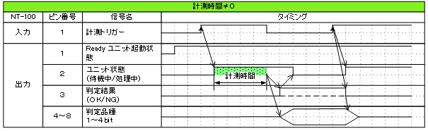

1. ReadyがＯＮであることを条件としてください。

> Ready出力は、NT-100嵌合音チェッカーが起動するとONになります。

2. 計測トリガーをＯＮにするとユニット状態が待機中（ＯＦＦ）→処理中（ＯＮ）となります。

3. 計測時間経過後、判定結果を出力しユニット状態が待機中となります。

4. 判定結果はＯＫ（ＯＮ）/ＮＧ（ＯＦＦ）と品種番号（１～３１）で、

> 次の計測トリガー入力でＯＦＦとなります。

- 計測時間を０にした時

　　　　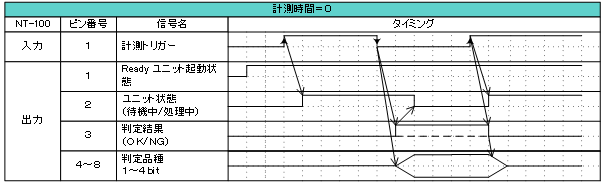

1. ReadyがＯＮであることを条件としてください。

> Ready出力は、NT-100嵌合音チェッカーが起動するとONになります。

2. 計測トリガーをＯＮにするとユニット状態が待機中（ＯＦＦ）→処理中（ＯＮ）となります。

3. 計測トリガーをＯＦＦにすると判定結果を出力しユニット状態が待機中となります。

4. 判定結果はＯＫ（ＯＮ）/ＮＧ（ＯＦＦ）と品種番号（１～３１）で、

> 次の計測トリガー入力でＯＦＦとなります。

- 手動操作

> トリガＳＷを押すと計測を開始し、再度トリガＳＷを押すと計測を終了します。

　　計測結果

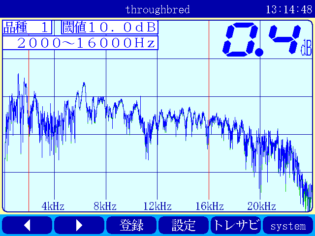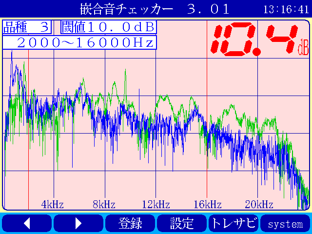

　　　　　　　　　　　　　　　　　　　　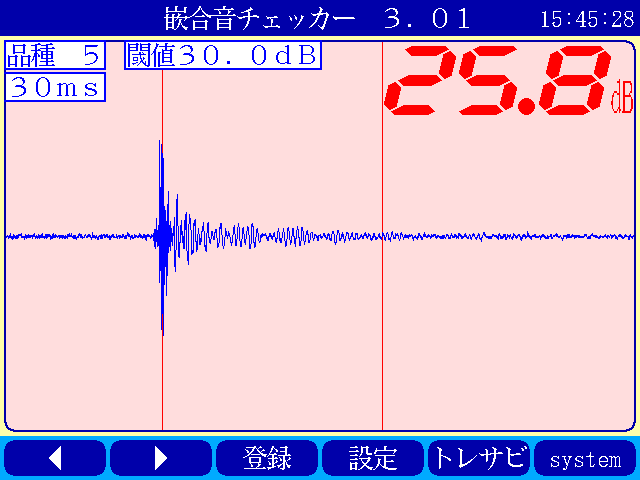

　　　　　　　　　　　　　　　　　　　　　　　　　　　減衰率ＮＧの画面

- 設定されている周波数・閾値、判定された品種・マスターとの差分が表示されます。

- 品種１は登録されている品種名が表示されています。

- マスターデータが緑、今回のデータが青でグラフ表示されます。

- 周波数領域が赤色でライン表示されます。

- 減衰率がＮＧの場合は波形と減衰率が表示されます。

- トレサビ設定に従ってトレサビデータが出力されます。

　　　　計測動作については4.1.3設定画面を参照してください。

　　登録

　　　　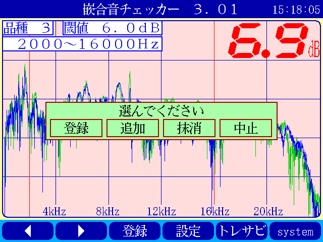

　　登録ボタンを押すと４択になります。

　　　　・登録：登録画面に飛びます。

　　　　・追加：現在取り込まれている音をマスターとして空いている品種に登録します。

　　　　　空きがない場合はエラー表示が出ます。

　　　　・抹消：現在選ばれている品種番号のマスターを抹消します。

　　　　・中止：何もしません。

　　ヒント：目的の音のバラツキが大きくてＮＧ判定になった場合、追加するとよいでしょう（画面参照）。

　　逆に目的の音ではないのにマスターとの差分が小さい音は、無効属性で追加するとよいでしょう。

　　この場合、閾値を上げてワンショットモードで試してみると、

本来の閾値近辺にいる紛らわしい音を簡単に見つけることができます。

***4 機能***

### トレサビ画面

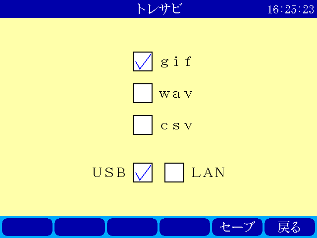

　【ボタン機能】

| ボタン | 内容                                 |
|--------|--------------------------------------|
| セーブ | 設定内容を内蔵メモリにセーブします。 |
| 戻る   | メイン画面に戻ります。               |

　【設定データ】

| 設定    | 内容                                                                   |
|---------|------------------------------------------------------------------------|
| ｇｉｆ  | 判定結果のスクリーンショット（注１）                                   |
| ｗａｖ  | 嵌合音波形（注２）                                                     |
| ｃｓｖ  | ＯＫ/ＮＧ判定結果（注３）                                              |
| USB/LAN | トレサビを残すメディアをUSBメモリ（注４）、LAN（注５）から選択します。 |

注１：ファイル名は年月日時分秒（例：2016-08-23 09-41-12.gif）

注２：ファイル名は年月日時分秒（例：2016-08-23 09-41-12.wav）

注３：ファイル名は年月日（例：2016-08-23.csv）

内容は時分秒、品種番号、FFT判定値、減衰率、判定結果（例：09.41.12, 1,
4.2, 22.7,NG）

　　　　　 　　 同じファイルに追記されて行きます

注４:USBメモリは付属しておりません（動作保証されているUSBメモリは、3.2　機能仕様を参照してください）。

注５:ＬＡＮを選択した場合、別途無償でご提供するＰＣアプリケーションが必要となります。

　　　　　　　 弊社営業窓口へお問い合わせください。

***4 機能***

### 設定画面

計測に関するパラメータを設定する画面です。

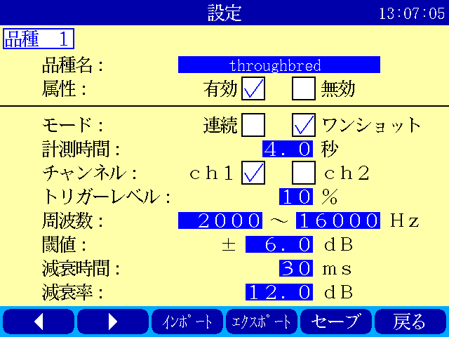

　【ボタン機能】

| ボタン  | 内容                                               |
|---------|----------------------------------------------------|
|         | 品種番号を選択します。                             |
| ｲﾝﾎﾟｰﾄ  | マスターと各種設定をＵＳＢメモリからロードします。 |
| ｴｸｽﾎﾟｰﾄ | マスターと各種設定をＵＳＢメモリにセーブします。   |
| セーブ  | マスターと各種設定内容を内蔵メモリにセーブします。 |
| 戻る    | メイン画面に戻ります。                             |

　【設定データ】

<table>
<colgroup>
<col style="width: 14%" />
<col style="width: 65%" />
<col style="width: 19%" />
</colgroup>
<thead>
<tr class="header">
<th>設定</th>
<th>内容</th>
<th>設定値範囲</th>
</tr>
</thead>
<tbody>
<tr class="odd">
<td>品種名</td>
<td>メイン画面で表示される品種名を登録します。</td>
<td>半角24全角12</td>
</tr>
<tr class="even">
<td>属性</td>
<td>マスターの属性を設定します(注１)</td>
<td></td>
</tr>
<tr class="odd">
<td>モード</td>
<td>動作モードを設定します（注１）</td>
<td></td>
</tr>
<tr class="even">
<td>計測時間</td>
<td>
Ｉ／Ｏで計測を開始してから終了するまでの時間を設定します。

０．０秒を設定するとＩ／Ｏで計測終了します。
</td>
<td>0.0～9.9秒</td>
</tr>
<tr class="odd">
<td>ﾁｬﾝﾈﾙ</td>
<td>計測対象となるチャンネル（１または２）を設定します。</td>
<td></td>
</tr>
<tr class="even">
<td>トリガーレベル</td>
<td>
波形を取り込むトリガーレベルを設定します（注１）

画面いっぱいが１００％です。
</td>
<td>0～99</td>
</tr>
<tr class="odd">
<td>周波数</td>
<td>判定を行う周波数範囲を設定します。</td>
<td>0～24000Hz</td>
</tr>
<tr class="even">
<td>閾値</td>
<td>判定を行う閾値を設定します。</td>
<td>0.0～99.9dB</td>
</tr>
<tr class="odd">
<td>減衰時間</td>
<td>
波形のピークから減衰率を判定するまでの時間を設定します。

0msに設定すると減衰率による判定をおこないません（注２）。
</td>
<td>0～50ms</td>
</tr>
<tr class="even">
<td>減衰率</td>
<td>波形のピーク値からの減衰率を設定します（注２）。</td>
<td>0.0～99.9dB</td>
</tr>
</tbody>
</table>

　　品種名と属性が各品種独立に設定でき、残りは全品種共通です。

注１：計測中は以下の動作を繰り返します

　　　　　・波形がトリガーレベルを超えている前後８５．３ｍｓを取り込みます。

　　　　　・ＦＦＴを実行し、登録されている全マスターと比較して一番近いものを選びます。

　　　　　・有効属性のマスターが選ばれた場合は現在までの結果と比較してより良いものを残します。

　　　　　　動作モードがワンショットでＯＫ判定なら計測を終了します。

　　　ＯＫ・ＮＧ判定

　　　　　　有効属性のマスターが１度も選ばれなかった　→　ＮＧ

　　　　　　有効属性のマスターとの差が閾値以上　→　ＮＧ

　　　　　　有効属性のマスターとの差が閾値未満で減衰率による判定なし　→　ＯＫ

　　　　　　有効属性のマスターとの差が閾値未満で減衰率が閾値以上　→　ＯＫ

　　　　　　有効属性のマスターとの差が閾値未満で減衰率が閾値未満　→　ＮＧ（波形表示）

　　　トリガーレベルを超える波形が１００ｍｓ程度以下の間隔で発生した場合、

　　　片方を取りこぼしたり、正常に判定できないことがあります。

　　　ヒント：目的の音のバラツキが大きい場合、有効属性で複数個登録しておくと、

　　　閾値を小さく設定できるので、誤判定を防ぐことができる可能性があります。

　　　ヒント：目的の音に似ている外乱がある場合、その音を無効属性で登録しておくと、

　　　誤判定を防ぐことができる可能性があります。

注２：減衰時間と減衰率

>
>
> 

85.3ms

　　この例では波形のピークから３０ｍｓ後の減衰率を３０ｄＢに設定しており、

　　実際の減衰率が２５．８ｄＢだったのでＮＧ（減衰率不足）と判定されています。

　　稀に持続音の外乱のＦＦＴ結果がマスターと近い場合があり、

　　この機能によって減衰音であることを確認することで誤動作を防ぐことができます。

　　減衰時間と減衰率の説明の都合上減衰音でＮＧを表示させていますが、

　　通常この波形であればＯＫと判定させるのが妥当でしょう。

　　ヒント：閾値と減衰率を９９．９ｄＢに設定して嵌合音の合否判定をおこなえば、

　　この画面にて減衰率を確認することができます。

***4 機能***

### 登録画面

判定の基準となるマスターを登録します。

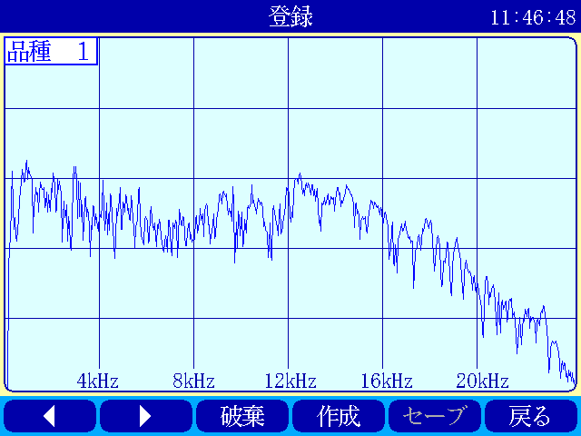

　【ボタン機能】

| ボタン | 内容                                                       |
|--------|------------------------------------------------------------|
|        | 品種番号を選択します。                                     |
| 破棄   | 最後に採取したマスター候補を破棄します。                   |
| 作成   | 採取した複数のマスター候補を平均してマスターを作成します。 |
| セーブ | マスターと各種設定内容を内蔵メモリにセーブします。         |
| 戻る   | メイン画面に戻ります。                                     |

- 登録する品種番号を選択します。

- トリガＳＷを押すとトリガレベルを超えるマスターの採取を開始します。

- 再度トリガＳＷを押すと、入力信号をＦＦＴ解析し、結果をグラフ表示します。

> 最大１０回までデータ取りが可能で、グラフの表示色が変わります。
>
> １０回を超える場合はエラー表示が出ます。

- 破棄ボタンを押すと、最新のデータを破棄します。

> ※外乱等で余計な音が入ってしまった場合に使用します。

- 作成ボタンを押すと、マスター候補の平均を算出しマスターデータとします。

- セーブボタンを押すと、作成したマスターデータを保存します。

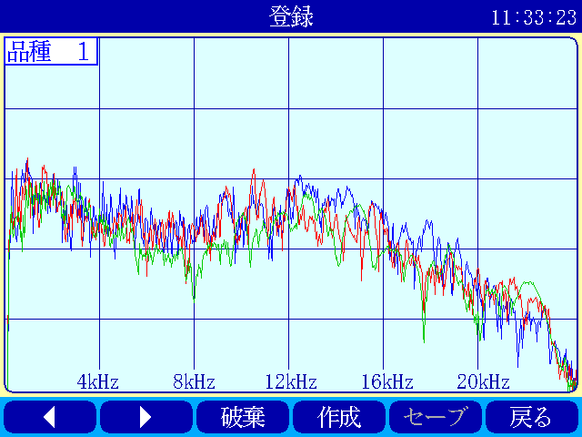

　　　　　　　　　　　　　　　　　　 作成

***4 機能***

### システムメニュー画面

本ユニットにおけるシステム的な設定やメンテナンスを実施するためのメニュー画面です。

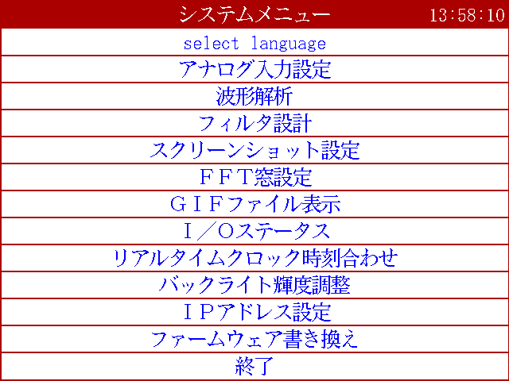

　【システムメニュー】

| 項目                 | 内容                                                                  |
|----------------------|-----------------------------------------------------------------------|
| Select language      | 英語⇔日本語を選択します（自動的にセーブされます）                     |
| ｱﾅﾛｸﾞ入力設定        | 各チャンネルのアナログゲインを調整します。                            |
| 波形解析             | チャンネルに入力されている信号を波形、FFTでモニタ及び録音ができます。 |
| ﾌｨﾙﾀ設計             | 4種類のフィルタを設計する画面に移行します。                           |
| ｽｸﾘｰﾝｼｮｯﾄ設定        | 波形解析のスクリーンショットの保存先を設定します。                    |
| FFT窓設定            | 波形解析のFFT表示に使う窓関数を選択します。                           |
| ＧＩＦﾌｧｲﾙ表示       | 保存したスクリーンショットを選択、再描画します。                      |
| Ｉ/Ｏｽﾃｰﾀｽ           | 外部入出力ポート端子の状態をモニタします。                            |
| ﾘｱﾙﾀｲﾑｸﾛｯｸ時刻合わせ | 現在時刻合わせを行います。                                            |
| ﾊﾞｯｸﾗｲﾄ輝度調整      | 表示器の輝度調整を行います。                                          |
| IPｱﾄﾞﾚｽ設定          | PCとLANで接続するためのIPアドレスを設定します。                       |
| ﾌｧｰﾑｳｪｱ書き換え      | USBまたはLANで本ユニットのバージョンアップを行います。                |
| 終了                 | メイン画面に戻ります。                                                |

***4 機能***

### アナログ入力設定画面

マイクや振動センサなどの入力信号レベルを調整する画面です。

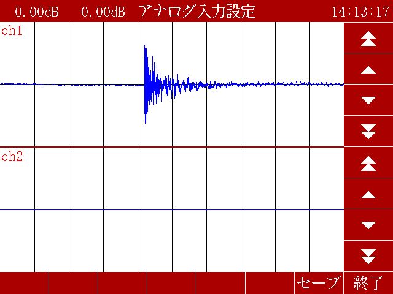

1. ｃｈ１入力調整領域

> ｃｈ１の入力データのリアルタイム波形が表示されます。
>
> ▲ボタンや▼ボタンなどで、ゲイン調整を行います。

2. ｃｈ２入力調整領域

> ｃｈ２の入力データのリアルタイム波形が表示されます。
>
> ▲ボタンや▼ボタンなどで、ゲイン調整を行います。

3. 操作ボタン

- セーブ 設定状態を保存します。

- 終了 システムメニューに戻ります

　　　　　　　　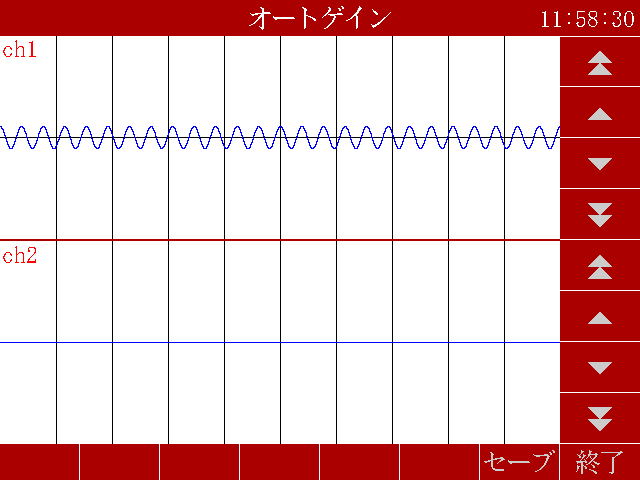

　　　　　　　　トリガＳＷを押すと、アナログ信号が安定するまで２秒待ってから、オートゲインモードに入ります。

もう一度トリガＳＷを押すと、それまでに入力された信号に従って自動でゲインが設定されます。

信号が入力されていないチャンネルのゲインは変更されません。

***4 機能***

### フィルタ設計表示

マイクや振動センサなどの入力信号にかけるフィルタを設計する画面です。

フィルタは用途に応じて4種類から選択します。

　【機能】

<table>
<colgroup>
<col style="width: 14%" />
<col style="width: 85%" />
</colgroup>
<thead>
<tr class="header">
<th>名称</th>
<th>内容</th>
</tr>
</thead>
<tbody>
<tr class="odd">
<td>LPF</td>
<td>ローパスフィルタを選択及び解除します。 
選択されると必要なパラメータを表示します。</td>
</tr>
<tr class="even">
<td>HPF</td>
<td>ハイパスフィルタを選択及び解除します。 
選択されると必要なパラメータを表示します。</td>
</tr>
<tr class="odd">
<td>BPF</td>
<td>バンドパスフィルタを選択及び解除します。 
選択されると必要なパラメータを表示します。</td>
</tr>
<tr class="even">
<td>BEF</td>
<td>バンドエリミネートフィルタを選択及び解除します。 
選択されると必要なパラメータを表示します。</td>
</tr>
<tr class="odd">
<td>設計</td>
<td>選択したフィルタと設定値からフィルタを作成します。</td>
</tr>
<tr class="even">
<td>F特</td>
<td>設計後のフィルタの周波数特性グラフを表示します。</td>
</tr>
<tr class="odd">
<td>セーブ</td>
<td>
フィルタを内部メモリに保存します。

フィルタ設定→解除した場合、セーブをしないと次回再起動時はフィルタ

設定した状態となります。
</td>
</tr>
<tr class="even">
<td>終了</td>
<td>システムメニューに戻ります。</td>
</tr>
</tbody>
</table>

注意：どのフィルタも選択されていない時はパラメータ表示はされません。

　　　また、フィルタ機能も無効となります。

***  
***

代表でBPFを選択した時のパラメータ表示を下図に示し、パラメータの説明をします。

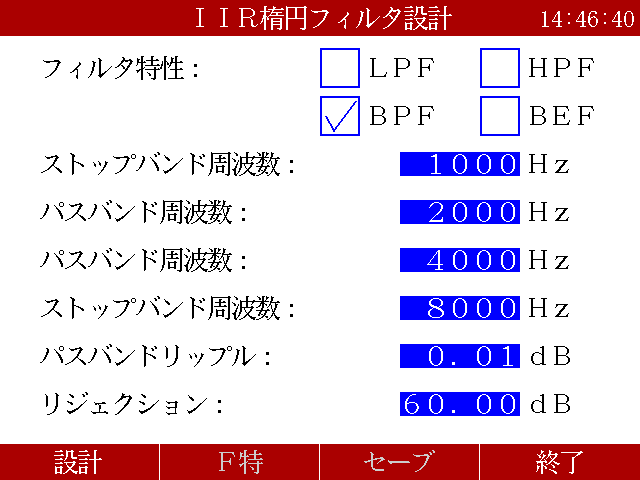

　【パラメータ】

|      | 名称                 | 内容                                               |
|------|----------------------|----------------------------------------------------|
| ①,①’ | パスバンド周波数     | 通過させたい周波数帯域の最大値又は最小値           |
| ②,②’ | ストップバンド周波数 | 阻止したい周波数帯域の最大値又は最小値             |
| ③    | パスバンドリップル   | 通過させたい周波数帯域のゲイン範囲（0.01dBを推奨） |
| ④    | リジェクション       | 阻止したい周波数帯域の減衰量（60～80dBを推奨）     |

各フィルタとパラメータ設定の関係を下図に示します。![][21]

設計したフィルタの周波数特性グラフ表示について説明します。

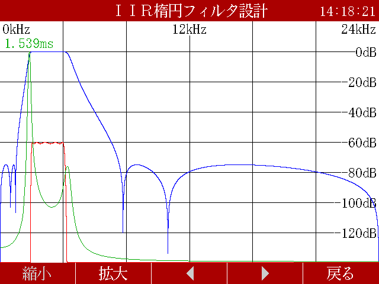
前述のBPFの設定値で設計したフィルタの周波数特性となります。

　拡大

　【波形】

<table>
<colgroup>
<col style="width: 11%" />
<col style="width: 26%" />
<col style="width: 61%" />
</colgroup>
<thead>
<tr class="header">
<th>色</th>
<th>内容</th>
<th>説明</th>
</tr>
</thead>
<tbody>
<tr class="odd">
<td>青</td>
<td>周波数特性</td>
<td>フィルタの効果を減衰量で示します。</td>
</tr>
<tr class="even">
<td>赤</td>
<td>パスバンド帯域振幅拡大</td>
<td>
パスバンド帯域の振幅を100倍で拡大したものになります。

リプルを確認できます。
</td>
</tr>
<tr class="odd">
<td>緑</td>
<td>群遅延</td>
<td>
入力波形に対する出力波形の遅延時間を示します。

数値はピークの時間です。（例では1.539ms）
</td>
</tr>
</tbody>
</table>

　【機能】

| ボタン     | 説明                                         |
|------------|----------------------------------------------|
| 縮小、拡大 | 横軸を拡大及び縮小します。                   |
|            | 横軸を拡大した状態で左右に画面を移動します。 |
| 戻る       | フィルタ設計画面に戻ります。                 |

***  
***

***4 機能***

### ＧＩＦファイル表示

保存されたスクリーンショットを選択し、再描画します。

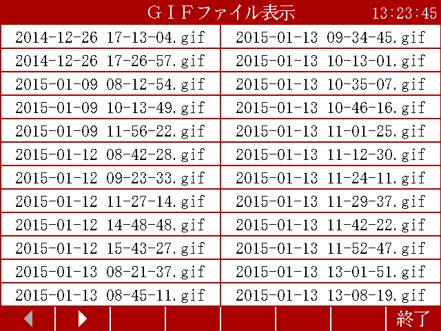

　【ボタン機能】

| ボタン | 内容                         |
|--------|------------------------------|
|        | 表示ページを変更します。     |
| 終了   | システムメニューに戻ります。 |

　　　　　　ファイルを選択すると画面に表示し、トリガＳＷでこの画面に戻ります。

　　　　　　本ユニット以外で作成したファイルを選択した場合の動作は不定です。

***4 機能***

### Ｉ／Ｏステータス画面

> 外部入出力ポート端子の状態をモニタします。

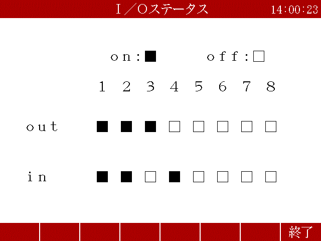

　【ボタン機能】

| ボタン | 内容                         |
|--------|------------------------------|
| 戻る   | システムメニューに戻ります。 |

> 【操作】

ｏｕｔ部　□（■）を押下すると本体背面の出力ポート状態をＯＮ/ＯＦＦできます。

　　ｉｎ部　□（■）本体背面の入力ポート状態を表示します。

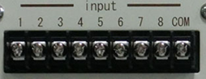*  
*

***4 機能***

### 　ファームウェア書き換え

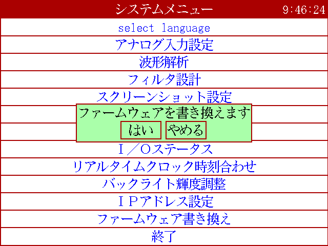

******「はい」を選択するとＬＡＮとＵＳＢのチェックを開始します。

　　ＬＡＮで書き換える場合

別途無償でご提供するＰＣアプリケーションが必要となります。

　　　　弊社営業までお問合せください。

　　ＵＳＢメモリで書き換える場合

　　　　ＵＳＢメモリにDSPというフォルダを作成し、

　　　　そこに弊社がご提供するDSP.motファイルを格納してＮＴ－１００に挿してください。

　　　　動作保証されているＵＳＢメモリは３．２機能仕様を参照してください。

***4 機能***

## 計測手順

本ユニットを使って計測するまでの手順は、下記の通りです。

　　　　マイクや振動センサの入力信号レベルを調整します。

　　　　　　　　　　　　　　　　　　　　　　　　　　4.1.6アナログ入力設定画面を参照してください。

　　　　計測に関する設定を行います。

　　　　　　　　　　　　　　　　　　　　　　　　　　4.1.3設定画面を参照してください。

判定基準となるマスターデータ作成します。

4.1.2登録画面を参照してください

マスターデータと比較して合否判定をおこないます。

4.1.1メイン（計測）画面をを参照してください。

【メモ】

**５章　保守・定期点検**

　本章では、保守と定期点検の方法について説明します。

# 保守・定期点検

## 保守・定期点検について

機器の状態を常に最良に保ち、その性能を十分に発揮させるため、日常の運転監視以外に、半年に一回程度の

定期点検を実施してください。

保守
・点検作業は、電気の安全知識を持っている人が行い、機械的項目の点検時は、必ず電源を切ってください。

<table>
<colgroup>
<col style="width: 26%" />
<col style="width: 30%" />
<col style="width: 43%" />
</colgroup>
<tbody>
<tr class="odd">
<td>点検項目</td>
<td>点検内容</td>
<td>判定基準</td>
</tr>
<tr class="even">
<td>接続状態</td>
<td>
端子ネジのゆるみ

コネクタのゆるみ

ケーブルの接続状態
</td>
<td>
ゆるみのないこと。

ゆるみのないこと。

コネクタ部にゆるみのないこと。
</td>
</tr>
<tr class="odd">
<td>ユニット外観</td>
<td>コネクタ部の目詰まり</td>
<td>粉塵などによる目詰まりがないこと。</td>
</tr>
<tr class="even">
<td>周囲環境</td>
<td>
周囲温度・盤内温度

周囲湿度・盤内湿度

雰囲気
</td>
<td>
0 ～ 60 ℃

5 ～ 85 ％RH

有毒・腐食性ガスのないこと。
</td>
</tr>
</tbody>
</table>

また、保守・点検の結果、廃棄する部品が発生した場合、それぞれの行政に従って廃棄してください。

**６章　お問い合わせ**

　本章では、問い合わせ方法について説明します。

# お問い合わせ

注意

性能・品質の向上等に伴い、お断り無く掲載事項を変更させて頂く場合があります。予めご了承下さい。

  [9]: #製品の概要
  [1]: #概要
  [2]: #外観寸法
  [11]: #据付
  [3]: #設置条件
  [4]: #設置環境
  [12]: #設置
  [15]: #仕様
  [5]: #本体仕様
  [6]: #機能仕様
  [16]: #各部の仕様
  [7]: #前面
  [17]: #背面
  [18]: #外部入出力
  [8]: #入力仕様シンク型
  [10]: #入力仕様ソース型
  [19]: #出力仕様シンク型
  [13]: #出力仕様ソース型
  [22]: #機能
  [14]: #画面構成
  [23]: #メイン計測画面
  [27]: #トレサビ画面
  [28]: #設定画面
  [31]: #登録画面
  [32]: #システムメニュー画面
  [33]: #アナログ入力設定画面
  [35]: #フィルタ設計表示
  [38]: #ｇｉｆファイル表示
  [39]: #ｉｏステータス画面
  [40]: #ファームウェア書き換え
  [41]: #計測手順
  [43]: #保守定期点検
  [20]: #保守定期点検について
  [44]: #お問い合わせ
  [21]: ./media/image35.emf
